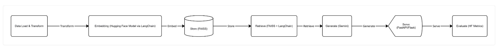

# Hcl_Hackathon_Grp
## Problem Statement Chosen: Building A Mini-RAG Powered Assistant  

Fig. 1: Data Load & Transform (LangChain) ->Embedding (Hugging Face Model via Langchain) ->Store (FAISS)->Retrieve (FAISS +LangChain)->Generate (Gemini) ->Serve (FastAPI) 
## Plan Implemented 
### Plan of Action  
1. Source, Load, and Transform using LangChain 
We will gather raw documents, load them into LangChain, and clean/structure them for further processing. 
2. Embedding using Hugging Face 
We will convert the cleaned text into numerical vector embeddings using a HuggingFace embedding model. 
3. Storing in FAISS 
We will store these embeddings in a FAISS vector database for fast semantic search and retrieval. 
4. Passing context to Gemini for final response generation 
We will retrieve the relevant chunks from FAISS and send them as context to Gemini to generate accurate answers. 
5. Deployment using FastAPI or Flask 
We will wrap the entire pipeline into a simple API using FastAPI/Flask so users can query the RAG assistant. 

### Structure and Flow
#### 1. Introduction
This project is a Retrieval-Augmented Generation (RAG) based chatbot that can answer questions using information stored in a document corpus.
 Instead of relying only on an LLM, the system retrieves relevant information from documents and generates accurate, context-based responses.
The entire project consists of: 
- A Python FastAPI backend that runs the RAG pipeline 
- A Node.js + HTML/JS frontend that provides a chat interface 

A clean and modular code structure so each part of the RAG workflow is easy to understand and extend
The final result is a fully working end-to-end RAG application.
#### 2. What the Project Does
When a user asks a question, the system: 
-Converts the question into embeddings 
-Finds the most relevant document chunks using vector similarity 
-Sends the question + retrieved context to an LLM 

Returns a final answer to the user. This makes the chatbot accurate and grounded — it answers based on real documents, not hallucinations. 
#### 3. Backend Overview (FastAPI + Python)
The backend is the main engine of the project. It performs all RAG operations. 
**Backend Components** 
-main.py: Runs the FastAPI server and exposes the /query API endpoint. This is what the frontend calls. 
-splitter.py: Breaks large documents into smaller chunks so retrieval becomes more accurate. 
-embeddings.py: Converts text into numerical embeddings using a transformer model. 
-vectorstore.py: Stores embeddings and performs similarity search. This is how the system finds relevant information. 
-models.py: Loads and connects to the LLM (like an OpenAI model). 
-agent.py: This file combines everything by retrieving relevant chunks, builds the final prompt,generates the answer using the LLM. This is the “brain” of the RAG pipeline. 
-tests/test_rag.py: Contains tests to verify the RAG pipeline and retrieval logic. 

Overall, the backend is modular and easy to extend — you can plug in new models, new documents, or new vector stores without rewriting everything.
#### 4. Frontend Overview (Node.js + HTML/CSS/JS)
The frontend provides a simple chat interface that the user interacts with. 
**Frontend Files** 
-index.html: The structure of the page — message area, input box, send button. 
-style.css: Styles the chat box, user messages, and bot responses. 
-app.js: The logic of the frontend is that it first reads user input;second it displays user message; third, it sends request to backend; fourth, it displays the bot's response 
-server.js: A simple Node.js server that hosts the frontend on localhost:3000. 
The frontend is intentionally simple and clean, making it easy for anyone to use. 
#### 5. How Everything Works Together
-User types a question in the chat UI 
-Frontend sends it to the FastAPI backend 
**Backend:** 
-embeds the question 
-retrieves similar document chunks 
-sends the context + question to the LLM 
-receives the generated answer 
-Backend returns the answer 
-Frontend displays it in the chat window 
This flow feels smooth and natural, just like using ChatGPT but with your own knowledge base. 
#### 6. Features of the System
-Fully functional end-to-end RAG implementation. 
-Simple and clean user interface. Modular architecture 
-Accurate, context-based answers 
-Easy to extend (more documents, more models, cloud vector stores, etc.) 
-Fast and responsive 

#### 7. Conclusion
This project successfully demonstrates how to build a real Retrieval-Augmented Generation system from scratch.
 It shows how document chunking, embeddings, vector search, and LLMs can be combined into a single working application.
The system is practical, scalable, and can be extended into: 
-enterprise knowledge assistants 
-PDF-based Q&A bots 
-internal documentation search tools 
-domain-specific chatbots 
Overall, this is a solid foundation for any real-world AI assistant. 

The implementation details of running the frontend and backend on your system is given respective in their READMEs(README files are inside the frontend and backend folder). 

Same Information Also Shared In The Below Doc: 
https://docs.google.com/document/d/1mRPzlmNzZTav-5Y-umTrdVucLc3_evJ_WxQhlPboI7M/edit?tab=t.0
